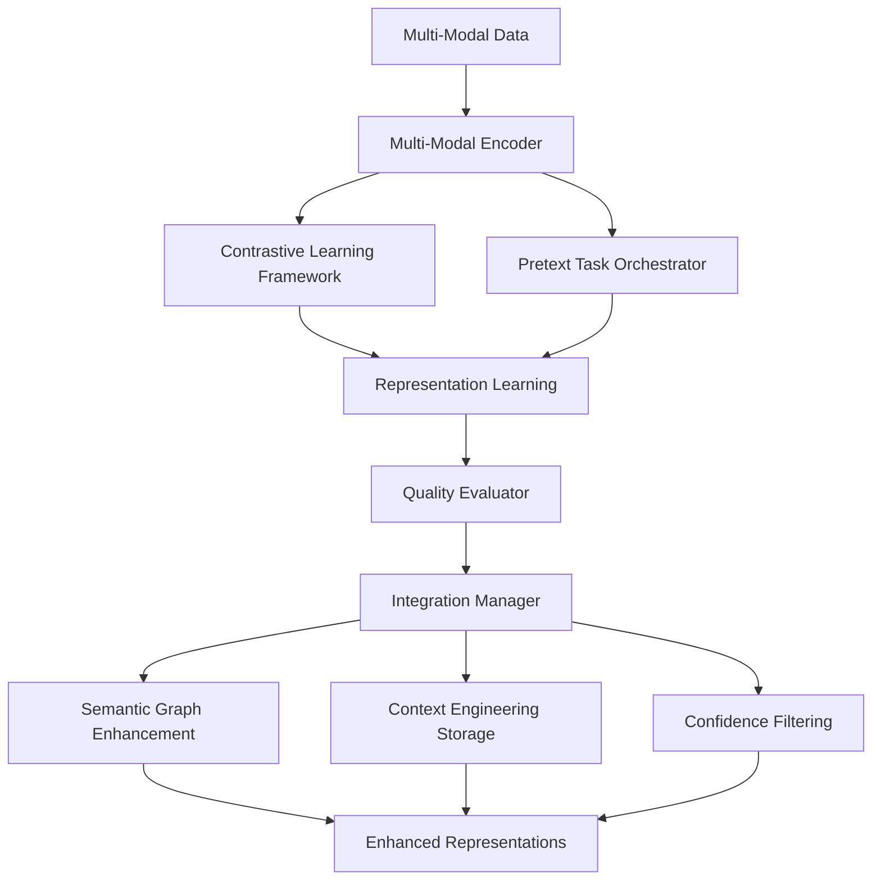

# Self-Supervised Representation Learning (SSRL) Integration Guide

## Overview

This guide provides comprehensive documentation for integrating Self-Supervised Representation Learning (SSRL) with the AI Research Agent system. SSRL enables the system to learn rich, meaningful representations from unlabeled data through various pretext tasks and contrastive learning strategies.

## Architecture Overview



## Core Components

### 1. Multi-Modal Encoder
Handles different data modalities with specialized architectures:

- **Text Encoder**: Transformer-based encoder for natural language
- **Code Encoder**: Specialized encoder for programming languages
- **Structured Data Encoder**: MLP-based encoder for tabular data
- **Graph Encoder**: Graph Neural Network for graph-structured data

### 2. Contrastive Learning Framework
Implements multiple contrastive learning strategies:

- **SimCLR**: Simple contrastive learning with data augmentation
- **InfoNCE**: Information-theoretic contrastive learning
- **MoCo**: Momentum contrast with memory queue
- **BYOL**: Bootstrap your own latent without negative samples

### 3. Pretext Task Orchestrator
Manages multiple self-supervised tasks with adaptive curriculum:

- **Masked Language Modeling**: Predict masked tokens
- **Next Sentence Prediction**: Predict sentence relationships
- **Code Completion**: Complete partial code snippets
- **Graph Reconstruction**: Reconstruct corrupted graphs
- **Contrastive Learning**: Learn from positive/negative pairs

### 4. Representation Quality Evaluator
Comprehensive evaluation of learned representations:

- **Downstream Performance**: Task-specific accuracy
- **Clustering Quality**: Unsupervised clustering metrics
- **Linear Separability**: Linear probe performance
- **Representation Diversity**: Pairwise distance analysis
- **Semantic Consistency**: Semantic label consistency

## Integration Points

### Semantic Graph Integration

#### Node Enhancement
```python
# Enhance representations with graph context
enhanced_reps = integration_manager.enhance_representations_with_graph(
    representations=base_representations,
    content_items=text_content
)
```

#### Path Confidence
```python
# Use representation quality for path selection
path_confidence = semantic_alignment.guide_path_selection(
    candidate_paths=reasoning_paths
)
```

### Context Engineering Integration

#### Memory Storage
```python
# Store high-quality representations in appropriate memory tiers
integration_manager.store_representations_in_memory(
    representations=representations,
    content_items=content,
    quality_scores=quality_scores
)
```

#### Context Enhancement
```python
# Retrieve context enhanced with learned representations
enhanced_context = memory_manager.retrieve_memories_with_representations(
    query="research topic",
    use_ssrl_similarity=True
)
```

### Confidence Filtering Integration

#### Representation Filtering
```python
# Filter representations based on confidence scores
filtered_reps, indices = integration_manager.filter_representations_by_confidence(
    representations=representations,
    confidence_scores=confidence_scores
)
```

#### Quality-Confidence Correlation
```python
# Correlate representation quality with confidence metrics
correlation = evaluator.compute_quality_confidence_correlation(
    quality_scores=quality_scores,
    confidence_scores=confidence_scores
)
```

## Configuration

### Basic Configuration
```json
{
  "ssrl": {
    "encoder_dim": 768,
    "projection_dim": 256,
    "temperature": 0.07,
    "batch_size": 32,
    "learning_rate": 1e-4,
    "weight_decay": 1e-6
  }
}
```

### Advanced Configuration
```json
{
  "ssrl": {
    "encoder_dim": 768,
    "projection_dim": 256,
    "temperature": 0.07,
    "batch_size": 32,
    "learning_rate": 1e-4,
    "weight_decay": 1e-6,
    "momentum": 0.999,
    "queue_size": 65536,
    
    "task_weights": {
      "masked_lm": 0.3,
      "contrastive": 0.4,
      "next_sentence": 0.1,
      "code_completion": 0.2
    },
    
    "curriculum_enabled": true,
    "curriculum_schedule": "linear",
    
    "integrate_semantic_graph": true,
    "integrate_context_engineering": true,
    "integrate_confidence_filtering": true
  }
}
```

## Usage Examples

### Basic Usage
```python
from extensions.stage_9_ssrl import integrate_ssrl_system, SSRLConfig

# Initialize SSRL system
config = SSRLConfig(encoder_dim=768, projection_dim=256)
ssrl_system = integrate_ssrl_system(config)

# Get representations
data = {"input_ids": torch.randn(32, 512)}
representations = ssrl_system.get_representations(data, ModalityType.TEXT)
```

### Training Loop
```python
# Training with multiple pretext tasks
for epoch in range(num_epochs):
    epoch_summary = await ssrl_system.train_epoch(data_loader, epoch)
    
    # Evaluate every 5 epochs
    if epoch % 5 == 0:
        quality = ssrl_system.evaluate_representations(eval_loader)
        print(f"Quality Score: {quality.confidence_score:.3f}")
```

### Integration Example
```python
# Complete integration workflow
async def integrated_research_workflow(query: str):
    # Get SSRL representations
    query_rep = ssrl_system.get_representations(
        {"text": query}, ModalityType.TEXT
    )
    
    # Enhance with semantic graph
    enhanced_rep = integration_manager.enhance_representations_with_graph(
        query_rep, [query]
    )
    
    # Store in context memory
    integration_manager.store_representations_in_memory(
        enhanced_rep, [query], [0.9]
    )
    
    # Filter by confidence
    filtered_rep, _ = integration_manager.filter_representations_by_confidence(
        enhanced_rep, [0.85]
    )
    
    return filtered_rep
```

## Performance Metrics

### Key Metrics to Monitor

1. **Representation Quality**
   - Downstream task accuracy: > 0.8
   - Clustering silhouette score: > 0.6
   - Linear separability: > 0.75

2. **Training Efficiency**
   - Convergence rate: < 50 epochs
   - Loss stability: variance < 0.1
   - Task balance: all tasks > 0.3 performance

3. **Integration Health**
   - Graph enhancement rate: > 80%
   - Memory storage success: > 95%
   - Confidence filter pass rate: 70-90%

### Monitoring Dashboard
```python
# Get comprehensive system status
status = ssrl_system.get_system_status()

print(f"Training Status: {status['training_status']}")
print(f"Quality Metrics: {status['quality_evaluation']}")
print(f"Integration Health: {status['integration_status']}")
```

## Best Practices

### 1. Data Preparation
- Ensure diverse, high-quality training data
- Balance different modalities appropriately
- Implement proper data augmentation strategies

### 2. Training Optimization
- Start with pre-trained encoders when possible
- Use curriculum learning for complex tasks
- Monitor task performance and adjust weights

### 3. Integration Strategy
- Enable integrations gradually
- Monitor integration health metrics
- Use fallback mechanisms for robustness

### 4. Quality Assurance
- Regular representation quality evaluation
- Cross-validation with downstream tasks
- Monitor for representation collapse

## Troubleshooting

### Common Issues

#### Poor Representation Quality
**Symptoms**: Low downstream accuracy, poor clustering
**Solutions**:
- Increase encoder capacity
- Adjust contrastive learning temperature
- Improve data augmentation strategies

#### Training Instability
**Symptoms**: Loss oscillations, gradient explosions
**Solutions**:
- Reduce learning rate
- Add gradient clipping
- Use learning rate scheduling

#### Integration Failures
**Symptoms**: Low integration success rates
**Solutions**:
- Check component compatibility
- Verify configuration settings
- Enable debug logging

### Debug Commands
```bash
# Test SSRL system
python -m extensions.stage_9_ssrl --test

# Run integration tests
python -m extensions.tests.test_ssrl_integration

# Monitor training
python -c "
from extensions.stage_9_ssrl import integrate_ssrl_system
system = integrate_ssrl_system()
print(system.get_system_status())
"
```

## Advanced Topics

### Custom Pretext Tasks
```python
class CustomPretextTask:
    def __init__(self, task_name: str):
        self.task_name = task_name
    
    async def process_batch(self, batch: Dict[str, Any]) -> Tuple[torch.Tensor, Dict[str, float]]:
        # Implement custom pretext task logic
        pass
```

### Custom Contrastive Strategies
```python
class CustomContrastiveStrategy:
    def compute_contrastive_loss(self, query: torch.Tensor, 
                               key: torch.Tensor) -> torch.Tensor:
        # Implement custom contrastive learning strategy
        pass
```

### Multi-GPU Training
```python
# Distributed training setup
ssrl_system = torch.nn.DataParallel(ssrl_system)
ssrl_system = torch.nn.parallel.DistributedDataParallel(ssrl_system)
```

## Conclusion

SSRL integration provides powerful representation learning capabilities that enhance all aspects of the AI Research Agent system. By learning rich representations from unlabeled data and integrating with existing components, SSRL enables more effective research, better context understanding, and improved response quality.

For additional support and advanced configurations, refer to the API documentation and community resources.
